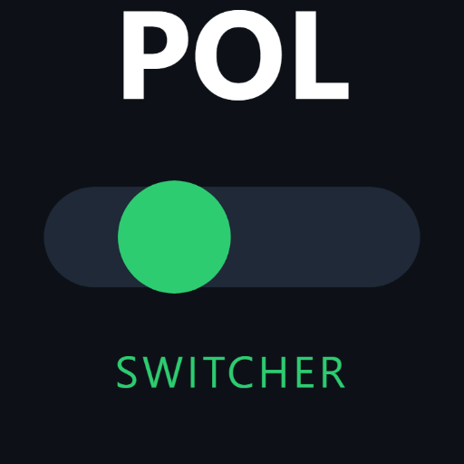

# Polylang Opposite Lang Switcher

**(You need to know: Cut / Move and Copy / Pate Operations)**

To display only the opposite language in the Polylang (e.g., showing only "sr_RS" while on an English page):

1. snippets plugin (Woody snippets)

2. Polylang (free)

## Installation

1. Copy "language-flags.css" to a new CSS snippet

2. Copy "oposite-lang-flag.php" to a new PHP snippet

3. Move from "wp-content" folder "polylang" and place it inside a LIVE / ACTIVE Wordpress ( directory "wp-content")